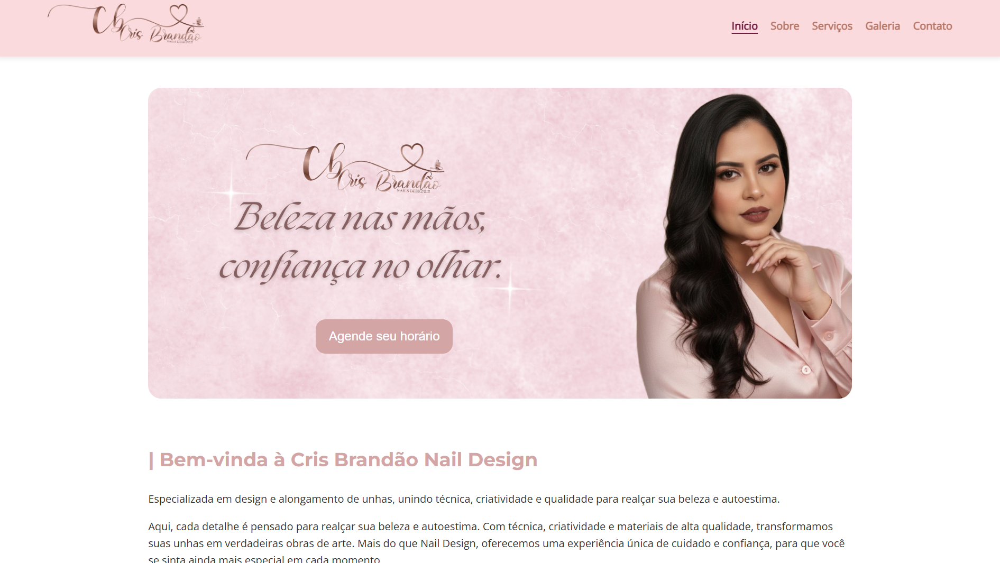

<h1 align="center">💅 Nail Designer Portfolio</h1>

<p align="center">
A modern, responsive institutional website developed to strengthen the online presence of a professional nail designer.
</p>

<p align="center">


</p>

---

# 📖 Overview

This project was developed for **Cris Brandão**, a professional nail designer, with the goal of creating a modern and responsive website to strengthen her digital presence and showcase her services.

The website was designed with a strong focus on usability, clean visual design, responsiveness, and intuitive navigation, allowing potential clients to easily explore the professional's work and contact information.

---

# 🎯 Project Information

| Information | Details |
|--------------|---------|
| **Project** | Nail Designer Portfolio |
| **Type** | Front-End Web Development |
| **Client** | Cris Brandão |
| **Status** | Completed |
| **Role** | Front-End Developer |
| **Technologies** | HTML5, CSS3, JavaScript |
| **Responsive** | ✅ Yes |

---

# 🚀 Live Demo

🔗 **Website**

https://manu400w.github.io/Nail-Designer-Portfolio/

---

# 📸 Preview

> **Desktop**

<p align="center">
  
</p>

---

# 🎯 The Challenge

Many independent beauty professionals rely exclusively on social media to promote their work.

The challenge of this project was to develop a professional website capable of:

- Presenting the professional and her services.
- Organizing portfolio images.
- Increasing credibility.
- Offering intuitive navigation.
- Improving the user experience across different devices.

---

# 💡 The Solution

A responsive multi-page website was developed with a modern interface focused on usability and visual organization.

The project includes:

- Home page
- About page
- Services page
- Gallery page
- Contact page
- Responsive navigation
- Professional visual identity

---

# ✨ Features

- ✅ Responsive Design
- ✅ Multi-page Navigation
- ✅ Modern User Interface
- ✅ Organized Information Architecture
- ✅ Portfolio Gallery
- ✅ Contact Information
- ✅ Mobile-Friendly Layout
- ✅ Clean Code Structure

---

# 🛠 Technologies

- HTML5
- CSS3
- JavaScript
- Git
- GitHub

---

# 📂 Project Structure

```text
📦 Nail-Designer-Portfolio
│
├── assets
│   └── images
│       ├── depoimentos
│       ├── galeria
│       ├── home
│       ├── services
│       └── shared
│
├── css
│
├── js
│
├── contato.html
├── galeria.html
├── index.html
├── servicos.html
├── sobre.html
│
└── README.md
```

---

# 📱 Responsive Design

The website was designed to provide an excellent browsing experience across different screen sizes.

- 💻 Desktop
- 📱 Mobile
- 📲 Tablet

---

# 🎨 Design Principles

The interface was designed following modern UI and UX principles:

- Simplicity
- Consistency
- Visual hierarchy
- Readability
- Accessibility
- Responsive Design

---

# 📈 Project Highlights

- Responsive multi-page website
- Organized folder structure
- Semantic HTML
- Modular CSS
- Vanilla JavaScript
- Clean visual identity
- Easy navigation
- Mobile-first approach

---

# 📚 What I Learned

Developing this project allowed me to strengthen several front-end development skills, including semantic HTML structuring, responsive layouts with CSS, JavaScript DOM manipulation, and project organization.

I also improved my understanding of version control using Git and GitHub while applying good development practices to create a maintainable and scalable codebase.

---

# 🚀 Future Improvements

Possible future enhancements include:

- Appointment scheduling
- WhatsApp integration
- Contact form with EmailJS
- Customer testimonials carousel
- Dark mode
- SEO optimization
- Performance improvements
- Accessibility enhancements
- Image optimization

---

# 👩‍💻 Author

**Emanuele Santos Felix da Fonseca**

Computer Science Student  
Universidade Católica de Brasília (UCB)

📧 **Email**

emanuelefonseca.cs@gmail.com

💼 **LinkedIn**

https://www.linkedin.com/in/emanuele-fonseca

🐙 **GitHub**

https://github.com/manu400w

---

# 📄 License

This project is available for educational and portfolio purposes.

---

# ⭐ About This Project

This project was developed as part of my learning journey in Web Development

Beyond practicing HTML, CSS, and JavaScript, it also helped me improve my understanding of user-centered interface design, project organization, and version control with Git and GitHub.

I continuously improve my projects as I learn new technologies and software engineering concepts.
